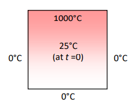

# Jacobi_Iterative_With_Mutex
A multi-threaded program that computes the heat distribution problem based on the Jacobi iterative  method.

## Enrivonment: Linux

### Heat Distribution Problem
The heat distribution problem is an important study in science/engineering and plays a key role in climate modeling and weather forecasting. The two-dimensional (2D) heat distribution problem is to find the steady state temperature distribution within an area which has known fixed temperatures along each of its edges.



### Jacobi Iterative Method
The above equation is essentially the Gauss-Seidel iterative method which relies on a sequential order of computation and is thus more difficult to parallelize. In this assignment, we adopt the Jacobi iterative method:

```
𝑤[𝑖,𝑗] = (𝑢[𝑖 − 1,𝑗] + 𝑢[𝑖 + 1,𝑗] + 𝑢[𝑖,𝑗 − 1] + 𝑢[𝑖, 𝑗 + 1]) / 4
```

In the Jacobi method, we use two 2D arrays to store the temperature distribution. The array w stores the current iteration’s solution while the array u stores the previous iteration’s solution. For each iteration, we calculate the temperature value of a point by computing the average temperature value of its four neighbors obtained from the previous iteration.

### Use multithreading and synchronization to improve the calculation effiency

## To run the code:

#### Use the default setings: rows = 200, columns = 200, threads = 2
```
./jacobi_cond
```

### Use other parameters: e.g., rows = 400, columns = 400, threads = 8
```
./jacobi_cond 400 400 8
```

